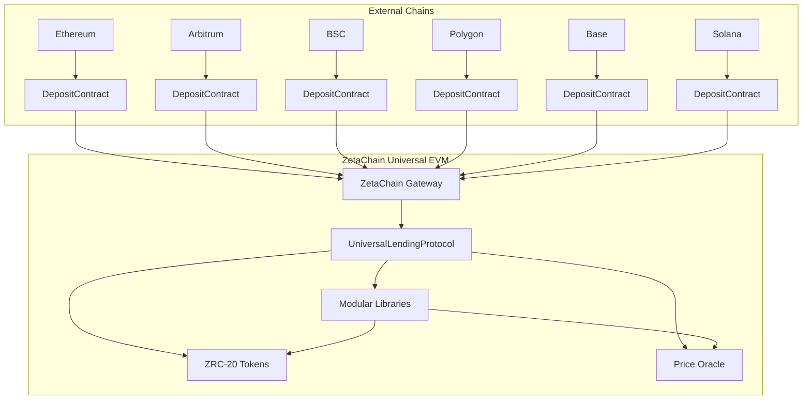
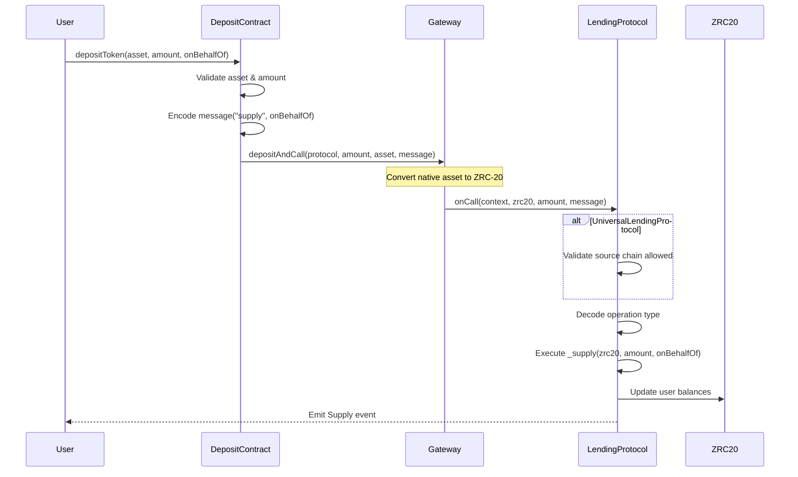
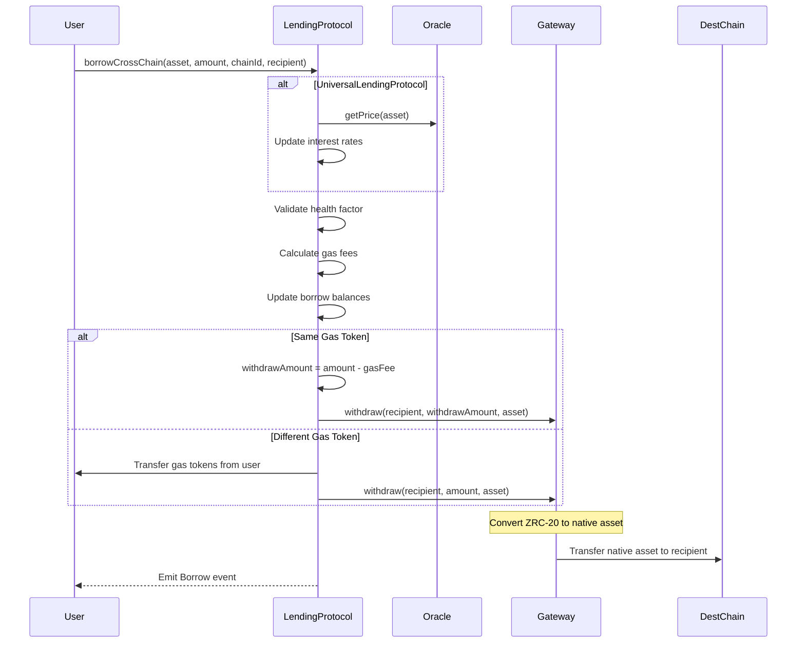
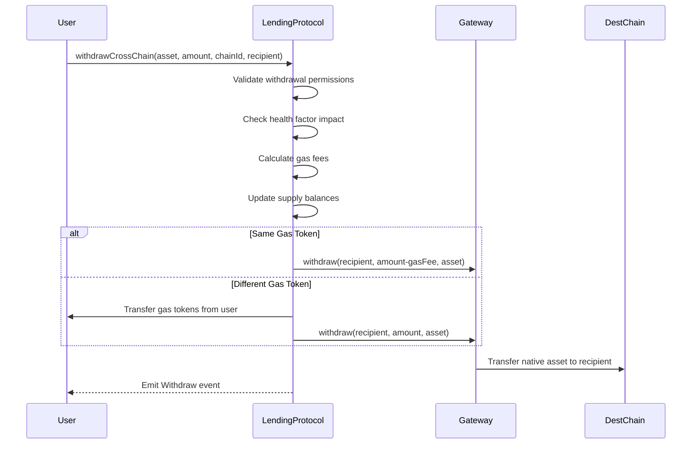

# Cross-Chain Lending Architecture and Implementation Guide

## Overview

This document provides a comprehensive technical guide to the cross-chain lending protocol architecture, focusing on the gateway integration, message flows, and cross-chain operation mechanisms that enable seamless lending across Ethereum, Arbitrum, BSC, Polygon, Base, Solana, and ZetaChain.

## Architecture Components

### 1. Protocol Layer Architecture



### 2. Cross-Chain Message Flow

The protocol uses ZetaChain's Universal Contract interface to handle cross-chain operations through structured message passing:

#### Message Types and Encoding

**Standard Operations (128 bytes)**:
```solidity
// Supply or Repay operations
bytes memory message = abi.encode(
    "supply",     // or "repay"
    userAddress   // recipient address
);
```

**Advanced Operations (224 bytes)**:
```solidity
// Cross-chain borrow or withdraw
bytes memory message = abi.encode(
    "borrowCrossChain",    // or "withdrawCrossChain"
    userAddress,           // user initiating operation
    operationAmount,       // amount to borrow/withdraw
    destinationChainId,    // target chain ID
    recipientAddress       // recipient on destination chain
);
```

## Cross-Chain Operation Flows

### 1. Cross-Chain Deposit Flow



### 2. Cross-Chain Borrowing Flow



### 3. Cross-Chain Withdrawal Flow



## Gateway Integration Patterns

### 1. Universal Contract Implementation

```solidity
contract LendingProtocolBase is UniversalContract {
    
    function onCall(
        MessageContext calldata context,
        address zrc20,
        uint256 amount,
        bytes calldata message
    ) external override onlyGateway {
        
        // Validate source chain (UniversalLendingProtocol only)
        if (isUniversalProtocol && !allowedSourceChains[context.chainID]) {
            revert ChainNotAllowed(context.chainID);
        }
        
        // Decode message based on length
        if (message.length == 128) {
            _handleStandardOperation(zrc20, amount, message);
        } else if (message.length == 224) {
            _handleAdvancedOperation(zrc20, amount, message);
        } else {
            revert("Invalid message format");
        }
    }
    
    function onRevert(
        RevertContext calldata revertContext
    ) external override onlyGateway {
        // Handle failed cross-chain transactions
        emit Withdraw(address(0), revertContext.asset, revertContext.amount);
    }
}
```

### 2. Gas Fee Handling Strategy

The protocol implements sophisticated gas fee management for cross-chain operations:

```solidity
function _handleCrossChainGas(address asset, uint256 amount) internal {
    (address gasZRC20, uint256 gasFee) = IZRC20(asset).withdrawGasFee();
    
    if (asset == gasZRC20) {
        // Same token: deduct gas from withdrawal amount
        uint256 withdrawalAmount = amount - gasFee;
        IERC20(asset).approve(address(gateway), amount); // Full amount for gas
        gateway.withdraw(recipient, withdrawalAmount, asset, revertOptions);
    } else {
        // Different token: collect gas fee separately
        IERC20(gasZRC20).transferFrom(user, address(this), gasFee);
        IERC20(gasZRC20).approve(address(gateway), gasFee);
        IERC20(asset).approve(address(gateway), amount);
        gateway.withdraw(recipient, amount, asset, revertOptions);
    }
}
```

## ZRC-20 Asset Management

### 1. Asset Mapping Configuration

```typescript
// ZRC-20 to source chain mapping (Deployed on ZetaChain Athens 7001)
const zrc20Mapping = {
    // Ethereum assets
    "0x05BA149A7bd6dC1F937fA9046A9e05C05f3b18b0": {
        symbol: "ETH.ETH",
        sourceChain: 11155111, // Ethereum Sepolia
        decimals: 18
    },
    "0xcC683A782f4B30c138787CB5576a86AF66fdc31d": {
        symbol: "USDC.ETH",
        sourceChain: 11155111, // Ethereum Sepolia
        decimals: 6
    },
    // Arbitrum assets
    "0x1de70f3e971B62A0707dA18100392af14f7fB677": {
        symbol: "ETH.ARBI",
        sourceChain: 421614, // Arbitrum Sepolia
        decimals: 18
    },
    "0x4bC32034caCcc9B7e02536945eDbC286bACbA073": {
        symbol: "USDC.ARBI", 
        sourceChain: 421614, // Arbitrum Sepolia
        decimals: 6
    },
    // BSC assets
    "0x...": {
        symbol: "BNB.BSC",
        sourceChain: 56, // BSC mainnet
        decimals: 18
    },
    "0x...": {
        symbol: "USDC.BSC",
        sourceChain: 56, // BSC mainnet
        decimals: 18
    },
    // Polygon assets
    "0x...": {
        symbol: "MATIC.POLYGON",
        sourceChain: 137, // Polygon mainnet
        decimals: 18
    },
    "0x...": {
        symbol: "USDC.POLYGON",
        sourceChain: 137, // Polygon mainnet
        decimals: 6
    },
    // Base assets
    "0x...": {
        symbol: "ETH.BASE",
        sourceChain: 8453, // Base mainnet
        decimals: 18
    },
    "0x...": {
        symbol: "USDC.BASE",
        sourceChain: 8453, // Base mainnet
        decimals: 6
    },
    // Solana assets (represented as ZRC-20 on ZetaChain)
    "0x...": {
        symbol: "SOL.SOLANA",
        sourceChain: "solana-mainnet",
        decimals: 9
    },
    "0x...": {
        symbol: "USDC.SOLANA",
        sourceChain: "solana-mainnet",
        decimals: 6
    }
};
```

### 2. Asset Configuration Management

```solidity
// UniversalLendingProtocol asset configuration
struct AssetConfig {
    bool isSupported;
    uint256 collateralFactor;      // 80% for ETH, 90% for USDC
    uint256 liquidationThreshold;  // 85% for ETH, 95% for USDC  
    uint256 liquidationBonus;      // 5% liquidator incentive
    uint256 borrowRate;            // Current borrow APR
    uint256 supplyRate;            // Current supply APR
    uint256 totalSupply;           // Total supplied amount
    uint256 totalBorrow;           // Total borrowed amount
}

function addAsset(
    address asset,
    uint256 collateralFactor,
    uint256 liquidationThreshold,
    uint256 liquidationBonus
) external onlyOwner {
    enhancedAssets[asset] = AssetConfig({
        isSupported: true,
        collateralFactor: collateralFactor,
        liquidationThreshold: liquidationThreshold,
        liquidationBonus: liquidationBonus,
        borrowRate: 0,
        supplyRate: 0,
        totalSupply: 0,
        totalBorrow: 0
    });
}
```

## Security Validation Layers

### 1. Multi-Layer Chain Validation

```solidity
// UniversalLendingProtocol source chain validation
mapping(uint256 => bool) public allowedSourceChains;

function setAllowedSourceChain(uint256 chainId, bool allowed) external onlyOwner {
    allowedSourceChains[chainId] = allowed;
    emit AllowedChainUpdated(chainId, allowed);
}

// Currently allowed chains:
// 1 (Ethereum)
// 42161 (Arbitrum)
// 56 (BSC)
// 137 (Polygon)
// 8453 (Base)
// solana-mainnet (Solana)
```

### 2. Asset Validation Framework

```solidity
// DepositContract asset validation
struct SupportedAsset {
    bool isSupported;
    uint8 decimals;
    bool isNative;  // true for ETH, false for ERC20
}

mapping(address => SupportedAsset) public supportedAssets;

function addSupportedAsset(
    address asset,
    uint8 decimals,
    bool isNative
) external onlyOwner {
    supportedAssets[asset] = SupportedAsset({
        isSupported: true,
        decimals: decimals,
        isNative: isNative
    });
}
```

### 3. Health Factor Protection

```solidity
// Enhanced health factor validation across protocols
function _validateHealthFactor(address user, address asset, uint256 newDebt) internal view {
    uint256 healthFactor = _calculateHealthFactorInternal(
        user, asset, userSupplies[user][asset], newDebt, true
    );
    require(healthFactor >= MINIMUM_HEALTH_FACTOR, "Insufficient collateral");
}

// Multiple validation points:
// 1. Before borrowing operations
// 2. Before withdrawal operations  
// 3. During liquidation checks
// 4. In cross-chain operations
```

## Advanced Cross-Chain Features

### 1. Cross-Chain Source Validation (Universal Protocol)

```solidity
function onCall(
    MessageContext calldata context,
    address zrc20,
    uint256 amount,
    bytes calldata message
) external override onlyGateway {
    
    // Universal protocol validates source chains
    if (!allowedSourceChains[context.chainID]) {
        revert ChainNotAllowed(context.chainID);
    }
    
    // Process validated cross-chain operation
    _processValidatedOperation(context, zrc20, amount, message);
}
```

### 2. Dynamic Interest Rate Integration

```solidity
// UniversalLendingProtocol interest rate updates
function _supply(address asset, uint256 amount, address onBehalfOf) internal override {
    _updateInterest(asset);  // Apply accrued interest
    super._supply(asset, amount, onBehalfOf);
    enhancedAssets[asset].totalSupply += amount;
    _updateInterestRates(asset);  // Recalculate rates
}

function _updateInterest(address asset) internal {
    AssetConfig storage config = enhancedAssets[asset];
    uint256 timeElapsed = block.timestamp - lastGlobalInterestUpdate[asset];
    
    if (timeElapsed > 0 && config.totalBorrow > 0) {
        uint256 interestAccrued = (config.totalBorrow * config.borrowRate * timeElapsed) 
                                 / (365 days * PRECISION);
        config.totalBorrow += interestAccrued;
        
        // 10% to protocol reserves
        totalReserves[asset] += (interestAccrued * RESERVE_FACTOR) / PRECISION;
    }
    
    lastGlobalInterestUpdate[asset] = block.timestamp;
}
```

## Deployment and Configuration Guide

### 1. Network-Specific Deployment

```bash
# ZetaChain (7000) - Main Protocol
export ZETA_MAINNET_RPC="https://zetachain-evm.blockpi.network/v1/rpc/public"
export ZETA_MAINNET_CHAIN_ID=7000

# Ethereum (1) - Deposit Contract
export ETHEREUM_RPC="https://mainnet.infura.io/v3/YOUR_PROJECT_ID"
export ETHEREUM_CHAIN_ID=1

# Arbitrum (42161) - Deposit Contract
export ARBITRUM_RPC="https://arb1.arbitrum.io/rpc"
export ARBITRUM_CHAIN_ID=42161

# BSC (56) - Deposit Contract
export BSC_RPC="https://bsc-dataseed1.binance.org/"
export BSC_CHAIN_ID=56

# Polygon (137) - Deposit Contract
export POLYGON_RPC="https://polygon-rpc.com/"
export POLYGON_CHAIN_ID=137

# Base (8453) - Deposit Contract
export BASE_RPC="https://mainnet.base.org"
export BASE_CHAIN_ID=8453

# Solana - Deposit Contract
export SOLANA_RPC="https://api.mainnet-beta.solana.com"
```

### 2. Sequential Deployment Process

```bash
# 1. Deploy main protocol on ZetaChain
bun hardhat run scripts/universal/deploy-universal-lending.ts --network zeta-mainnet

# 2. Deploy deposit contracts on all external chains
bun hardhat run scripts/deposit-contract/deploy-deposit-contracts.ts --network ethereum
bun hardhat run scripts/deposit-contract/deploy-deposit-contracts.ts --network arbitrum
bun hardhat run scripts/deposit-contract/deploy-deposit-contracts.ts --network bsc
bun hardhat run scripts/deposit-contract/deploy-deposit-contracts.ts --network polygon
bun hardhat run scripts/deposit-contract/deploy-deposit-contracts.ts --network base
bun hardhat run scripts/deposit-contract/deploy-deposit-contracts.ts --network solana

# 3. Configure cross-chain mappings
bun hardhat run scripts/universal/configure-cross-chain.ts --network zeta-mainnet

# 4. Test end-to-end flows
bun hardhat run scripts/deposit-contract/simulate-deposit.ts --network arbitrum
bun hardhat run scripts/universal/test-cross-chain-borrow.ts --network zeta-mainnet
```

### 3. Configuration Verification

```typescript
// Verify cross-chain configuration
const verifyConfiguration = async () => {
    // Check ZRC-20 mapping across multiple chains
    const ethArbiAddress = await universalProtocol.getZRC20ByChainAndSymbol(42161, "ETH");
    const bnbBscAddress = await universalProtocol.getZRC20ByChainAndSymbol(56, "BNB");
    const maticPolygonAddress = await universalProtocol.getZRC20ByChainAndSymbol(137, "MATIC");
    console.log("ETH.ARBI ZRC-20:", ethArbiAddress);
    console.log("BNB.BSC ZRC-20:", bnbBscAddress);
    console.log("MATIC.POLYGON ZRC-20:", maticPolygonAddress);
    
    // Check allowed source chains
    const isEthereumAllowed = await universalProtocol.isChainAllowed(1);
    const isArbitrumAllowed = await universalProtocol.isChainAllowed(42161);
    const isBscAllowed = await universalProtocol.isChainAllowed(56);
    const isPolygonAllowed = await universalProtocol.isChainAllowed(137);
    const isBaseAllowed = await universalProtocol.isChainAllowed(8453);
    console.log("Ethereum allowed:", isEthereumAllowed);
    console.log("Arbitrum allowed:", isArbitrumAllowed);
    console.log("BSC allowed:", isBscAllowed);
    console.log("Polygon allowed:", isPolygonAllowed);
    console.log("Base allowed:", isBaseAllowed);
    
    // Check asset configurations
    const ethConfig = await universalProtocol.getEnhancedAssetConfig(ethArbiAddress);
    console.log("ETH collateral factor:", ethConfig.collateralFactor);
    console.log("ETH liquidation threshold:", ethConfig.liquidationThreshold);
};
```

## Testing and Validation Framework

### 1. Cross-Chain Integration Tests

```typescript
describe("Cross-Chain Integration", () => {
    it("should handle deposits from multiple chains to ZetaChain", async () => {
        // Test 1: Deposit from Arbitrum
        const arbDepositAmount = parseUnits("1000", 6);
        await depositContract.depositToken(usdcArbiAddress, arbDepositAmount, userAddress);
        const arbSupply = await lendingProtocol.getSupplyBalance(userAddress, usdcArbiZrc20);
        expect(arbSupply).to.equal(arbDepositAmount);
        
        // Test 2: Deposit from BSC
        const bscDepositAmount = parseEther("1"); // 1 BNB
        await bscDepositContract.depositToken(bnbAddress, bscDepositAmount, userAddress);
        const bscSupply = await lendingProtocol.getSupplyBalance(userAddress, bnbBscZrc20);
        expect(bscSupply).to.equal(bscDepositAmount);
        
        // Test 3: Deposit from Polygon
        const polygonDepositAmount = parseEther("1000"); // 1000 MATIC
        await polygonDepositContract.depositToken(maticAddress, polygonDepositAmount, userAddress);
        const polygonSupply = await lendingProtocol.getSupplyBalance(userAddress, maticPolygonZrc20);
        expect(polygonSupply).to.equal(polygonDepositAmount);
    });
    
    it("should handle cross-chain borrowing to external chain", async () => {
        // Setup: User has collateral on ZetaChain
        await setupUserCollateral(userAddress, parseEther("2")); // 2 ETH collateral
        
        // Execute: Borrow USDC and withdraw to Arbitrum
        const borrowAmount = parseUnits("1000", 6);
        await lendingProtocol.borrowCrossChain(
            usdcArbiZrc20, borrowAmount, 421614, userAddress
        );
        
        // Verify: User received USDC on Arbitrum Sepolia
        const arbitrumBalance = await getArbitrumUsdcBalance(userAddress);
        expect(arbitrumBalance).to.equal(borrowAmount);
    });
});
```

### 2. Message Encoding Validation

```typescript
// Test message encoding for cross-chain operations
const testMessageEncoding = () => {
    // Standard 128-byte message for supply
    const supplyMessage = ethers.utils.defaultAbiCoder.encode(
        ["string", "address"],
        ["supply", userAddress]
    );
    console.log("Supply message length:", supplyMessage.length);
    
    // Advanced 224-byte message for cross-chain borrow
    const borrowMessage = ethers.utils.defaultAbiCoder.encode(
        ["string", "address", "uint256", "uint256", "address"],
        ["borrowCrossChain", userAddress, borrowAmount, 421614, recipientAddress]
    );
    console.log("Borrow message length:", borrowMessage.length);
};
```

## Performance Optimization

### 1. Gas-Optimized Calculations

The protocol uses custom libraries to minimize gas costs for cross-chain operations:

```solidity
// UserAssetCalculations library consolidates multiple calculations
UserAssetData memory assetData = UserAssetCalculations.calculateUserAssetData(
    user, modifiedAsset, newSupply, newDebt, useModified,
    supportedAssets, userSupplies, userBorrows, enhancedAssets, priceOracle
);

// Single calculation replaces multiple individual calls:
// - getTotalCollateralValue()
// - getTotalDebtValue() 
// - maxAvailableBorrows()
// - getUserAccountData()
// - getHealthFactor()
```

### 2. Efficient Cross-Chain State Management

```solidity
// Batch state updates for cross-chain operations
function _borrowCrossChainFromCall(
    address asset,
    uint256 amount,
    address user,
    uint256 destinationChain,
    bytes memory recipient
) internal {
    // Single state update for all related changes
    userBorrows[user][asset] += amount;
    enhancedAssets[asset].totalBorrow += amount;
    lastInterestUpdate[user][asset] = block.timestamp;
    
    // Single gateway call for cross-chain transfer
    gateway.withdraw(recipient, withdrawalAmount, asset, revertOptions);
}
```

## Monitoring and Analytics

### 1. Cross-Chain Event Tracking

```solidity
// Comprehensive event emission for monitoring
event CrossChainDeposit(
    address indexed user,
    address indexed asset,
    uint256 amount,
    uint256 indexed sourceChain,
    bytes32 transactionHash
);

event CrossChainBorrow(
    address indexed user,
    address indexed asset,
    uint256 amount,
    uint256 indexed destinationChain,
    address recipient
);

event CrossChainWithdraw(
    address indexed user,
    address indexed asset,
    uint256 amount,
    uint256 indexed destinationChain,
    address recipient
);
```

### 2. Health Factor Monitoring

```typescript
// Monitor user health factors across all positions
const monitorHealthFactors = async () => {
    const allUsers = await getAllUsers();
    
    for (const user of allUsers) {
        const healthFactor = await lendingProtocol.getHealthFactor(user);
        
        if (healthFactor < parseEther("1.3")) { // < 130%
            console.warn(`User ${user} at risk - Health Factor: ${healthFactor}`);
            
            // Trigger liquidation alerts
            if (healthFactor < parseEther("1.2")) { // < 120%
                await triggerLiquidationAlert(user, healthFactor);
            }
        }
    }
};
```

## Future Enhancements

### 1. Additional Chain Support

```solidity
// Framework for adding new chains
struct ChainConfig {
    bool isSupported;
    address gatewayAddress;
    uint256 minGasForExecution;
    mapping(string => address) nativeAssets;
}

mapping(uint256 => ChainConfig) public chainConfigs;

function addSupportedChain(
    uint256 chainId,
    address gateway,
    uint256 minGas
) external onlyOwner {
    chainConfigs[chainId] = ChainConfig({
        isSupported: true,
        gatewayAddress: gateway,
        minGasForExecution: minGas
    });
}
```

### 2. Advanced Cross-Chain Features

```solidity
// Multi-hop cross-chain operations
function borrowAndBridgeToMultipleChains(
    address asset,
    uint256 totalAmount,
    uint256[] calldata destinationChains,
    uint256[] calldata amounts,
    address[] calldata recipients
) external {
    require(destinationChains.length == amounts.length, "Length mismatch");
    require(destinationChains.length == recipients.length, "Length mismatch");
    
    // Single borrow operation
    _borrow(asset, totalAmount, address(this));
    
    // Distribute to multiple chains
    for (uint256 i = 0; i < destinationChains.length; i++) {
        _withdrawCrossChain(asset, amounts[i], destinationChains[i], recipients[i]);
    }
}
```

---

This comprehensive cross-chain architecture enables truly universal lending operations while maintaining security, efficiency, and user experience across multiple blockchain networks.