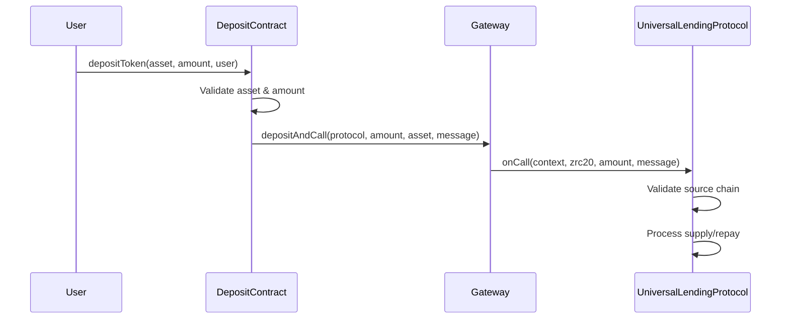
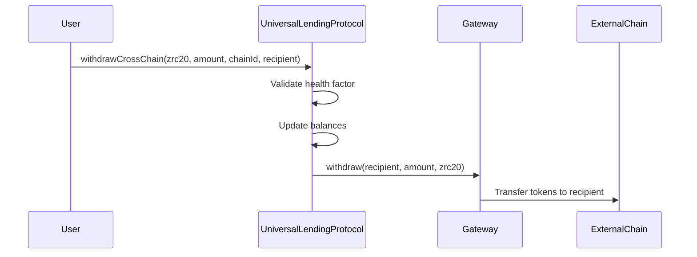

# Cross-Chain Lending Protocol on ZetaChain

## Overview

This project implements a **cross-chain lending protocol** built on ZetaChain that enables users to:

1. **Deposit collateral from allowed external chains** (Arbitrum Sepolia, Ethereum Sepolia)
2. **Perform lending operations** on ZetaChain (supply, borrow, repay, liquidate)
3. **Withdraw assets to any supported destination chain**

## Architecture

### Core Components

#### 1. UniversalLendingProtocol (ZetaChain)
- **Location**: `contracts/UniversalLendingProtocol.sol`
- **Purpose**: Main lending contract deployed on ZetaChain
- **Features**:
  - Implements ZetaChain's `UniversalContract` interface
  - Validates deposits only from allowed source chains
  - Enables withdrawals to any destination chain
  - Standard lending operations (supply, borrow, repay, liquidate)

#### 2. DepositContract (External Chains)
- **Location**: `contracts/DepositContract.sol`
- **Purpose**: Deployed on external chains to facilitate cross-chain deposits
- **Features**:
  - Validates supported assets (ETH, USDC)
  - Handles cross-chain deposits via ZetaChain Gateway
  - Supports both supply and repay operations

#### 3. Cross-Chain Configuration
- **Allowed Source Chains**: Only Arbitrum Sepolia (421614) and Ethereum Sepolia (11155111)
- **Supported Assets**: ETH and USDC on both chains
- **Withdrawal Destinations**: Any supported chain

## Security Model

### Deposit Validation
```solidity
// Only allowed chains can deposit
if (!allowedSourceChains[context.chainID]) {
    revert ChainNotAllowed(context.chainID);
}
```

### Asset Validation
```solidity
// Only supported ZRC-20 tokens accepted
if (!assets[zrc20].isSupported) revert AssetNotSupported(zrc20);
```

### Cross-Chain Message Authentication
```solidity
// Only gateway can call onCall function
modifier onlyGateway() {
    if (msg.sender != address(gateway)) revert Unauthorized();
    _;
}
```

## Cross-Chain Flow

### 1. Cross-Chain Deposit (External Chain → ZetaChain)



### 2. Cross-Chain Withdrawal (ZetaChain → External Chain)



## Smart Contract Interfaces

### UniversalLendingProtocol Key Functions

```solidity
// Cross-chain deposit handler (called by gateway)
function onCall(
    MessageContext calldata context,
    address zrc20,
    uint256 amount,
    bytes calldata message
) external override onlyGateway;

// Cross-chain withdrawal
function withdrawCrossChain(
    address zrc20,
    uint256 amount, 
    uint256 destinationChain,
    address recipient
) external;

// Admin functions
function setAllowedSourceChain(uint256 chainId, bool allowed) external onlyOwner;
function mapZRC20Asset(address zrc20, uint256 chainId, string calldata symbol) external onlyOwner;

// View functions
function isChainAllowed(uint256 chainId) external view returns (bool);
function getZRC20ByChainAndSymbol(uint256 chainId, string calldata symbol) external view returns (address);
```

### DepositContract Key Functions

```solidity
// ETH deposits
function depositEth(address onBehalfOf) external payable;
function repayEth(address onBehalfOf) external payable;

// ERC20 token deposits  
function depositToken(address asset, uint256 amount, address onBehalfOf) external;
function repayToken(address asset, uint256 amount, address onBehalfOf) external;

// Asset management
function addSupportedAsset(address asset, uint8 decimals, bool isNative) external onlyOwner;
function isAssetSupported(address asset) external view returns (bool);
```

## Deployment Guide

### 1. Deploy on ZetaChain

```bash
# Deploy UniversalLendingProtocol on ZetaChain Athens Testnet
npx hardhat run scripts/universal/deploy-universal-lending.ts --network zeta-testnet
```

### 2. Deploy on External Chains

```bash
# Deploy DepositContract on Arbitrum Sepolia
npx hardhat run scripts/deposit-contract/deploy-deposit-contracts.ts --network arbitrum-sepolia

# Deploy DepositContract on Ethereum Sepolia  
npx hardhat run scripts/deposit-contract/deploy-deposit-contracts.ts --network ethereum-sepolia
```

### 3. Configuration

```bash
# Update contracts.json with deployed addresses
# Set lending protocol address in external chain configs
# Configure allowed chains and asset mappings
```

## Testing

### 1. Run Cross-Chain Tests

```bash
# Test cross-chain deposit simulation
npx hardhat run scripts/deposit-contract/simulate-deposit.ts --network arbitrum-sepolia
```

### 2. Manual Testing Flow

```typescript
// 1. Deposit from Arbitrum Sepolia
await depositContract.depositToken(usdcAddress, amount, userAddress);

// 2. Borrow on ZetaChain  
await universalLendingProtocol.borrow(ethZrc20Address, borrowAmount, userAddress);

// 3. Withdraw to Ethereum Sepolia
await universalLendingProtocol.withdrawCrossChain(
    usdcZrc20Address, 
    withdrawAmount, 
    11155111, // Ethereum Sepolia
    userAddress
);
```

## Configuration Files

### contracts.json Structure

```json
{
  "networks": {
    "7001": {
      "name": "ZetaChain Athens Testnet",
      "contracts": {
        "UniversalLendingProtocol": "0x...",
      },
      "tokens": {
        "ETH.ARBI": "0x...",
        "USDC.ARBI": "0x...",
        "ETH.ETH": "0x...", 
        "USDC.ETH": "0x..."
      }
    },
    "421614": {
      "name": "Arbitrum Sepolia",
      "contracts": {
        "DepositContract": "0x...",
        "Gateway": "0x..."
      },
      "tokens": {
        "ETH": "0x...",
        "USDC": "0x..."
      },
      "lendingProtocolAddress": "0x..." // UniversalLendingProtocol on ZetaChain
    }
  }
}
```

## Key Features

### ✅ Security Features
- **Chain Validation**: Only allowed source chains can deposit
- **Asset Validation**: Only whitelisted assets accepted
- **Health Factor**: Prevents risky withdrawals
- **Gateway Authentication**: Only authenticated gateway calls

### ✅ Cross-Chain Capabilities
- **Flexible Deposits**: From multiple allowed chains
- **Universal Withdrawals**: To any supported destination
- **ZRC-20 Integration**: Native ZetaChain token representation
- **Message Encoding**: Proper cross-chain communication

### ✅ Lending Features
- **Overcollateralized Lending**: 150% minimum health factor
- **Interest Rate Models**: Dynamic rates based on utilization
- **Liquidation System**: Automated liquidation at 120% threshold
- **Multiple Assets**: Support for ETH and USDC from different chains

## Network Addresses

### ZetaChain Athens Testnet (7001)
- **UniversalLendingProtocol**: `TBD` (Deploy with script)

### Arbitrum Sepolia (421614)
- **DepositContract**: `TBD` (Deploy with script)
- **Gateway**: `0x0dA86Dc3F9B71F84a0E97B0e2291e50B7a5df10f`

### Ethereum Sepolia (11155111)
- **DepositContract**: `0x55E1Bd43F67BaB1E176E2A65608C151bC0d8F148`
- **Gateway**: `0x0c487a766110c85d301d96e33579c5b317fa4995`

## Important Notes

1. **Gateway Addresses**: Update with actual ZetaChain gateway addresses for each network
2. **ZRC-20 Tokens**: Ensure correct ZRC-20 token addresses are configured
3. **Gas Fees**: Cross-chain operations include gas fees for destination chains
4. **Health Factors**: Monitor health factors to prevent liquidations
5. **Testing**: Thoroughly test on testnets before mainnet deployment

## Roadmap

- [ ] Integration with real ZetaChain gateway addresses
- [ ] Frontend interface for cross-chain operations  
- [ ] Additional asset support (BTC, more stablecoins)
- [ ] Advanced liquidation mechanisms
- [ ] Cross-chain governance features

## References

- [ZetaChain Universal Apps](https://www.zetachain.com/docs/developers/tutorials/swap/)
- [ZetaChain Cross-Chain Calls](https://www.zetachain.com/docs/developers/tutorials/call/)
- [ZetaChain Gateway Integration](https://www.zetachain.com/docs/developers/)

---

This cross-chain lending protocol demonstrates ZetaChain's capabilities for building truly universal, multi-chain applications while maintaining security and proper validation of cross-chain operations.