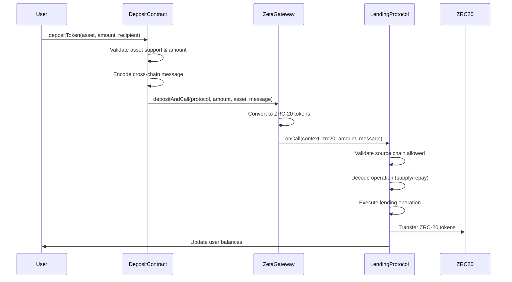
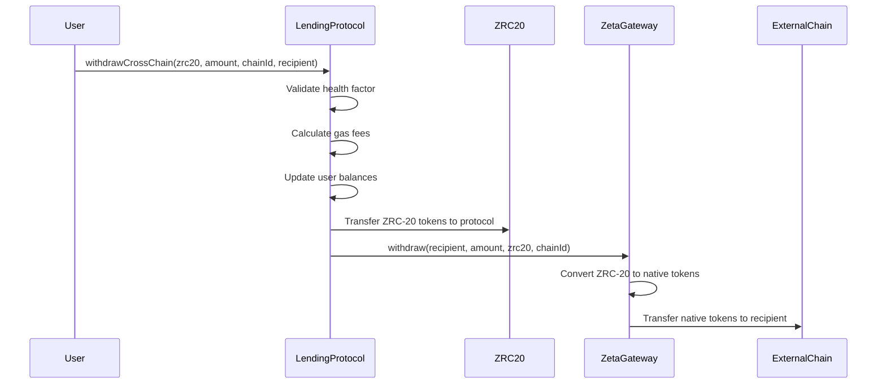
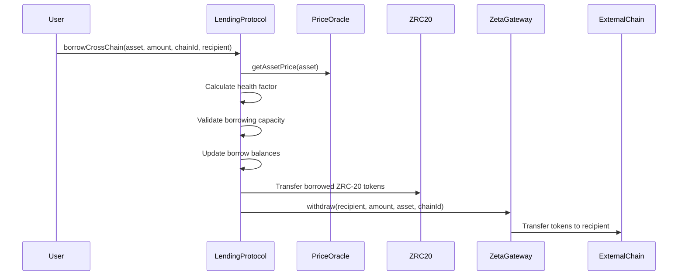

# ZetaChain Cross-Chain Lending Protocol

## Overview

This project implements a **comprehensive cross-chain lending protocol** built on ZetaChain that revolutionizes decentralized lending by enabling seamless cross-chain operations. Users can:

1. **Deposit collateral from multiple external chains** (Arbitrum Sepolia, Ethereum Sepolia)
2. **Perform advanced lending operations** on ZetaChain (supply, borrow, repay, liquidate) with both basic and advanced protocol options
3. **Withdraw assets to any supported destination chain** with complete flexibility
4. **Benefit from dynamic interest rates** and enhanced risk management (UniversalLendingProtocol)
5. **Utilize real-time price oracles** for accurate asset valuation and liquidation triggers

## Architecture

### Core Components

#### 1. Dual Protocol Architecture (ZetaChain)

**SimpleLendingProtocol** (`contracts/SimpleLendingProtocol.sol`)
- **Purpose**: Basic lending protocol with fixed interest rates and cross-chain support
- **Features**:
  - Fixed interest rate model for predictable returns
  - Cross-chain deposits and withdrawals via ZetaChain Gateway
  - Basic health factor calculations with fixed collateral factors
  - ZRC-20 asset support for cross-chain representations
  - Simple admin controls for asset and price management

**UniversalLendingProtocol** (`contracts/UniversalLendingProtocol.sol`)
- **Purpose**: Advanced lending protocol with dynamic features and enhanced risk management
- **Features**:
  - Dynamic interest rate model based on asset utilization (Aave-inspired)
  - Advanced cross-chain configuration with source chain validation
  - Enhanced risk management with configurable collateral factors and liquidation thresholds
  - External price oracle integration for real-time asset pricing
  - Reserve system for protocol revenue capture
  - Comprehensive user account data with detailed health factor calculations

#### 2. DepositContract (External Chains)
- **Location**: `contracts/DepositContract.sol`
- **Purpose**: Deployed on external chains to facilitate secure cross-chain deposits
- **Features**:
  - Validates supported assets (ETH, USDC) with proper decimals handling
  - Handles cross-chain deposits via ZetaChain Gateway with message encoding
  - Supports both supply and repay operations for flexible user interactions
  - Asset management with add/remove functionality for administrators
  - Gas fee handling for cross-chain transactions

#### 3. Enhanced Cross-Chain Configuration
- **Allowed Source Chains**: Configurable source chains (currently Arbitrum Sepolia 421614, Ethereum Sepolia 11155111)
- **Supported Assets**: ETH and USDC on both chains with proper ZRC-20 mapping
- **Withdrawal Destinations**: Any supported chain with flexible routing
- **Asset Mapping**: ZRC-20 tokens mapped to their source chains and symbols (ETH.ARBI, USDC.ARBI, ETH.ETH, USDC.ETH)
- **Gateway Authentication**: Proper message validation and authentication for security

## Enhanced Security Model

### Multi-Layer Security Architecture

#### 1. Cross-Chain Deposit Validation
```solidity
// UniversalLendingProtocol: Strict source chain validation
if (!allowedSourceChains[context.chainID]) {
    revert ChainNotAllowed(context.chainID);
}

// DepositContract: Asset support validation
if (!supportedAssets[asset].isSupported) {
    revert AssetNotSupported(asset);
}
```

#### 2. ZRC-20 Asset Validation
```solidity
// Only whitelisted ZRC-20 tokens accepted
if (!assets[zrc20].isSupported) revert AssetNotSupported(zrc20);

// Asset mapping validation for cross-chain operations
require(zrc20ToChainInfo[zrc20].chainId != 0, "Asset not mapped");
```

#### 3. Gateway Authentication and Authorization
```solidity
// Only authenticated gateway can call cross-chain functions
modifier onlyGateway() {
    if (msg.sender != address(gateway)) revert Unauthorized();
    _;
}

// Cross-chain message integrity validation
function onCall(MessageContext calldata context, address zrc20, uint256 amount, bytes calldata message) 
    external override onlyGateway {
    // Validate context and decode message safely
    _validateAndProcessCrossChainCall(context, zrc20, amount, message);
}
```

#### 4. Health Factor and Liquidation Security
```solidity
// UniversalLendingProtocol: Enhanced health factor validation
function _validateHealthFactor(address user) internal view {
    uint256 healthFactor = calculateHealthFactor(user);
    require(healthFactor >= MINIMUM_HEALTH_FACTOR, "Insufficient collateral");
}

// Liquidation threshold validation with configurable parameters
function _calculateLiquidationThreshold(address user) internal view returns (uint256) {
    // Uses configurable collateral factors and liquidation thresholds per asset
    return _getUserLiquidationThreshold(user);
}
```

#### 5. Oracle Price Security (UniversalLendingProtocol)
```solidity
// Price oracle validation with staleness checks
function getAssetPrice(address asset) internal view returns (uint256) {
    uint256 price = priceOracle.getPrice(asset);
    require(price > 0, "Invalid price");
    require(block.timestamp - priceOracle.getLastUpdate(asset) < MAX_PRICE_AGE, "Stale price");
    return price;
}
```

## Cross-Chain Flow

### 1. Enhanced Cross-Chain Deposit Flow (External Chain → ZetaChain)



### 2. Advanced Cross-Chain Withdrawal Flow (ZetaChain → External Chain)



### 3. Cross-Chain Borrowing Flow (Borrow on ZetaChain → Withdraw to External Chain)



## Smart Contract Interfaces

### SimpleLendingProtocol Core Functions

```solidity
// Basic lending operations
function supply(address zrc20, uint256 amount, address onBehalfOf) external;
function borrow(address zrc20, uint256 amount, address to) external;
function repay(address zrc20, uint256 amount, address onBehalfOf) external;
function withdraw(address zrc20, uint256 amount, address to) external;
function liquidate(address collateralAsset, address debtAsset, address user, uint256 debtToCover) external;

// Cross-chain operations
function borrowCrossChain(address zrc20, uint256 amount, uint256 destinationChain, address recipient) external;
function withdrawCrossChain(address zrc20, uint256 amount, uint256 destinationChain, address recipient) external;

// Cross-chain deposit handler (Universal Contract interface)
function onCall(MessageContext calldata context, address zrc20, uint256 amount, bytes calldata message) external override onlyGateway;
function onRevert(RevertContext calldata context) external override onlyGateway;

// Asset management
function addAsset(address zrc20, uint256 priceInUsd, uint256 collateralFactor) external onlyOwner;
function updatePrice(address zrc20, uint256 newPriceInUsd) external onlyOwner;

// View functions
function getHealthFactor(address user) external view returns (uint256);
function getTotalCollateralValue(address user) external view returns (uint256);
function getTotalDebtValue(address user) external view returns (uint256);
function getSupplyBalance(address user, address zrc20) external view returns (uint256);
function getBorrowBalance(address user, address zrc20) external view returns (uint256);
```

### UniversalLendingProtocol Advanced Functions

```solidity
// Enhanced lending operations with dynamic features
function supply(address zrc20, uint256 amount, address onBehalfOf) external;
function borrow(address zrc20, uint256 amount, address to) external;
function repay(address zrc20, uint256 amount, address onBehalfOf) external;
function withdraw(address zrc20, uint256 amount, address to) external;
function liquidate(address collateralAsset, address debtAsset, address user, uint256 debtToCover) external;

// Advanced cross-chain operations
function borrowCrossChain(address zrc20, uint256 amount, uint256 destinationChain, address recipient) external;
function withdrawCrossChain(address zrc20, uint256 amount, uint256 destinationChain, address recipient) external;

// Cross-chain deposit handler with enhanced validation
function onCall(MessageContext calldata context, address zrc20, uint256 amount, bytes calldata message) external override onlyGateway;
function onRevert(RevertContext calldata context) external override onlyGateway;

// Advanced asset management
function addAsset(address zrc20, uint256 collateralFactor, uint256 liquidationThreshold, uint256 liquidationBonus) external onlyOwner;
function setPriceOracle(address newPriceOracle) external onlyOwner;

// Cross-chain configuration
function setAllowedSourceChain(uint256 chainId, bool allowed) external onlyOwner;
function mapZRC20Asset(address zrc20, uint256 chainId, string calldata symbol) external onlyOwner;

// Enhanced view functions
function getUserAccountData(address user) external view returns (
    uint256 totalCollateralInUsd,
    uint256 totalDebtInUsd,
    uint256 availableBorrowsInUsd,
    uint256 currentLiquidationThreshold,
    uint256 healthFactor
);
function getAssetData(address zrc20) external view returns (
    uint256 totalSupply,
    uint256 totalBorrows,
    uint256 currentSupplyRate,
    uint256 currentBorrowRate,
    uint256 liquidityIndex,
    uint256 borrowIndex
);
function isChainAllowed(uint256 chainId) external view returns (bool);
function getZRC20ByChainAndSymbol(uint256 chainId, string calldata symbol) external view returns (address);
```

### DepositContract Key Functions

```solidity
// ETH deposits with proper handling
function depositEth(address onBehalfOf) external payable;
function repayEth(address onBehalfOf) external payable;

// ERC20 token deposits with validation
function depositToken(address asset, uint256 amount, address onBehalfOf) external;
function repayToken(address asset, uint256 amount, address onBehalfOf) external;

// Asset management with configuration
function addSupportedAsset(address asset, uint8 decimals, bool isNative) external onlyOwner;
function removeSupportedAsset(address asset) external onlyOwner;
function updateLendingProtocolAddress(address newLendingProtocol) external onlyOwner;

// View functions
function isAssetSupported(address asset) external view returns (bool);
function getSupportedAssets() external view returns (address[] memory);
function getAssetConfig(address asset) external view returns (uint8 decimals, bool isNative, bool isSupported);
function getLendingProtocolAddress() external view returns (address);
```

## Comprehensive Deployment Guide

### Phase 1: Deploy Main Protocol on ZetaChain

#### Option A: SimpleLendingProtocol (Basic Features)
```bash
# Deploy SimpleLendingProtocol with fixed interest rates
npx hardhat run scripts/simple/deploy-and-init-simple.ts --network zeta-testnet

# Alternative: Use complete redeployment script
./scripts/redeploy-and-init-simple.sh
```

#### Option B: UniversalLendingProtocol (Advanced Features)
```bash
# Deploy UniversalLendingProtocol with dynamic rates and enhanced features
npx hardhat run scripts/universal/deploy-universal-lending.ts --network zeta-testnet

# Alternative: Use complete redeployment script
./scripts/redeploy-and-init-universal.sh
```

### Phase 2: Deploy DepositContracts on External Chains

```bash
# Deploy DepositContract on Arbitrum Sepolia
npx hardhat run scripts/deposit-contract/deploy-deposit-contracts.ts --network arbitrum-sepolia

# Deploy DepositContract on Ethereum Sepolia  
npx hardhat run scripts/deposit-contract/deploy-deposit-contracts.ts --network ethereum-sepolia

# Add supported assets to DepositContracts
npx hardhat run scripts/deposit-contract/add-assets.ts --network arbitrum-sepolia
npx hardhat run scripts/deposit-contract/add-assets.ts --network ethereum-sepolia
```

### Phase 3: Configuration and Integration

```bash
# Update lending protocol addresses in DepositContracts
npx hardhat run scripts/deposit-contract/update-lending-protocol-address.ts --network arbitrum-sepolia
npx hardhat run scripts/deposit-contract/update-lending-protocol-address.ts --network ethereum-sepolia

# Verify all asset configurations
npx hardhat run scripts/simple/verify-assets.ts --network zeta-testnet
npx hardhat run scripts/deposit-contract/verify-assets.ts --network arbitrum-sepolia

# For UniversalLendingProtocol: Configure oracle prices
npx hardhat run scripts/universal/check-oracle-prices.ts --network zeta-testnet
```

## Comprehensive Testing Strategy

### 1. Cross-Chain Deposit Testing

```bash
# Test deposits from Arbitrum Sepolia to ZetaChain
npx hardhat run scripts/deposit-contract/simulate-deposit.ts --network arbitrum-sepolia

# Test deposits from Ethereum Sepolia to ZetaChain
npx hardhat run scripts/deposit-contract/simulate-deposit.ts --network ethereum-sepolia

# Verify balances after cross-chain deposits
npx hardhat run scripts/simple/check-balances.ts --network zeta-testnet
```

### 2. Cross-Chain Borrowing and Withdrawal Testing

```bash
# Test cross-chain borrowing operations
npx hardhat run scripts/simple/borrow-cross-chain.ts --network zeta-testnet

# Test cross-chain withdrawals (UniversalLendingProtocol)
npx hardhat run scripts/universal/withdraw-all-crosschain.ts --network zeta-testnet

# Test local withdrawals
npx hardhat run scripts/universal/withdraw-all-local.ts --network zeta-testnet
```

### 3. Complete End-to-End Testing Flow

#### Scenario 1: Basic Cross-Chain Lending (SimpleLendingProtocol)
```typescript
// 1. User deposits USDC from Arbitrum Sepolia
await depositContract.depositToken(usdcAddress, parseUnits("1000", 6), userAddress);
// Result: User has 1000 USDC.ARBI collateral on ZetaChain

// 2. User borrows ETH.ETH on ZetaChain
await simpleLendingProtocol.borrow(ethEthZrc20Address, parseEther("0.5"), userAddress);
// Result: User borrows 0.5 ETH.ETH against USDC.ARBI collateral

// 3. User withdraws borrowed ETH to Ethereum Sepolia
await simpleLendingProtocol.withdrawCrossChain(
    ethEthZrc20Address, 
    parseEther("0.5"), 
    11155111, // Ethereum Sepolia
    userAddress
);
// Result: User receives 0.5 ETH on Ethereum Sepolia
```

#### Scenario 2: Advanced Cross-Chain Lending (UniversalLendingProtocol)
```typescript
// 1. User deposits ETH from Ethereum Sepolia
await depositContract.depositEth(userAddress, { value: parseEther("2") });
// Result: User has 2 ETH.ETH collateral with dynamic interest rates

// 2. Check user account data with enhanced features
const accountData = await universalLendingProtocol.getUserAccountData(userAddress);
console.log("Health Factor:", accountData.healthFactor);
console.log("Available Borrows:", accountData.availableBorrowsInUsd);

// 3. User borrows USDC with dynamic rates
await universalLendingProtocol.borrow(usdcArbiZrc20Address, parseUnits("2000", 6), userAddress);
// Result: Borrowed with dynamic interest rate based on utilization

// 4. User withdraws borrowed USDC to Arbitrum Sepolia
await universalLendingProtocol.withdrawCrossChain(
    usdcArbiZrc20Address,
    parseUnits("2000", 6),
    421614, // Arbitrum Sepolia
    userAddress
);
// Result: User receives 2000 USDC on Arbitrum Sepolia
```

## Configuration Files

### contracts.json Structure

```json
{
  "networks": {
    "7001": {
      "name": "ZetaChain Athens Testnet",
      "contracts": {
        "SimpleLendingProtocol": "0x...",
        "UniversalLendingProtocol": "0x...",
        "PriceOracle": "0x..."
      },
      "tokens": {
        "ETH.ARBI": "0x13A0c5930C028511Dc02665E7285134B6d11A5f4",
        "USDC.ARBI": "0x48f80608B672DC30DC7e3dbBd0343c5F02C738Eb", 
        "ETH.ETH": "0xd97B1de3619ed2c6BEb3860147E30cA8A7dC9891",
        "USDC.ETH": "0x0cbe0dF132a6c6B4a2974Fa1b7Fb953CF0Cc798a"
      }
    },
    "421614": {
      "name": "Arbitrum Sepolia",
      "contracts": {
        "DepositContract": "0x...",
        "Gateway": "0x999999cf1046e68e36E1aA2E0E07105eDDD1f08E"
      },
      "tokens": {
        "ETH": "0x0000000000000000000000000000000000000000",
        "USDC": "0x75faf114eafb1BDbe2F0316DF893fd58CE46AA4d"
      },
      "lendingProtocolAddress": "0x..." // Main lending protocol on ZetaChain
    },
    "11155111": {
      "name": "Ethereum Sepolia", 
      "contracts": {
        "DepositContract": "0x...",
        "Gateway": "0x6c533f7fe93fae114d0954697069df33c9b74fd7"
      },
      "tokens": {
        "ETH": "0x0000000000000000000000000000000000000000",
        "USDC": "0x1c7D4B196Cb0C7B01d743Fbc6116a902379C7238"
      },
      "lendingProtocolAddress": "0x..." // Main lending protocol on ZetaChain
    }
  }
}
```

## Key Features and Capabilities

### 🔒 Enhanced Security Features
- **Multi-Layer Chain Validation**: Only pre-configured source chains can deposit (Arbitrum Sepolia, Ethereum Sepolia)
- **Comprehensive Asset Validation**: Only whitelisted ZRC-20 tokens accepted with proper mapping validation
- **Dynamic Health Factor Monitoring**: Prevents risky withdrawals with configurable thresholds
- **Gateway Authentication**: Strict authentication for cross-chain message handling
- **Oracle Price Security**: Price staleness checks and validation (UniversalLendingProtocol)
- **Liquidation Protection**: Automated liquidation system to maintain protocol solvency

### 🌐 Advanced Cross-Chain Capabilities
- **Multi-Chain Deposits**: Seamless deposits from Arbitrum Sepolia and Ethereum Sepolia
- **Universal Withdrawals**: Flexible withdrawals to any supported destination chain
- **ZRC-20 Integration**: Native ZetaChain token representation for cross-chain assets
- **Intelligent Message Encoding**: Proper cross-chain communication with operation routing
- **Gas Fee Management**: Automatic gas fee handling for cross-chain transactions
- **Cross-Chain Borrowing**: Borrow assets on ZetaChain and receive them on external chains

### 💰 Comprehensive Lending Features

#### SimpleLendingProtocol (Basic)
- **Fixed Interest Rates**: Predictable returns with manually set rates
- **Basic Health Factor**: Simple collateral ratio calculations
- **Cross-Chain Support**: Full cross-chain deposit and withdrawal functionality
- **Manual Price Management**: Administrator-controlled asset pricing

#### UniversalLendingProtocol (Advanced)
- **Dynamic Interest Rates**: Aave-inspired utilization-based rate models
- **Enhanced Health Factors**: Sophisticated collateral factor and liquidation threshold calculations
- **External Price Oracle**: Real-time asset pricing with staleness protection
- **Reserve System**: Protocol revenue capture from interest spreads
- **Advanced Liquidation**: Configurable liquidation bonuses and thresholds
- **Detailed User Analytics**: Comprehensive account data with borrowing capacity calculations

### 📊 Asset Support Matrix
- **ETH.ARBI**: Arbitrum ETH deposits → ZRC-20 representation
- **USDC.ARBI**: Arbitrum USDC deposits → ZRC-20 representation  
- **ETH.ETH**: Ethereum ETH deposits → ZRC-20 representation
- **USDC.ETH**: Ethereum USDC deposits → ZRC-20 representation
- **Cross-Chain Flexibility**: Any supported asset can be withdrawn to any supported chain

## Network Infrastructure

### ZetaChain Athens Testnet (7001)
- **SimpleLendingProtocol**: Deployed via scripts (address in contracts.json)
- **UniversalLendingProtocol**: Deployed via scripts (address in contracts.json)
- **PriceOracle**: External oracle integration for UniversalLendingProtocol
- **ZRC-20 Assets**:
  - ETH.ARBI: `0x13A0c5930C028511Dc02665E7285134B6d11A5f4`
  - USDC.ARBI: `0x48f80608B672DC30DC7e3dbBd0343c5F02C738Eb`
  - ETH.ETH: `0xd97B1de3619ed2c6BEb3860147E30cA8A7dC9891`
  - USDC.ETH: `0x0cbe0dF132a6c6B4a2974Fa1b7Fb953CF0Cc798a`

### Arbitrum Sepolia (421614)
- **DepositContract**: Deployed via scripts (address in contracts.json)
- **ZetaChain Gateway**: `0x999999cf1046e68e36E1aA2E0E07105eDDD1f08E`
- **Native Assets**:
  - ETH: `0x0000000000000000000000000000000000000000` (Native ETH)
  - USDC: `0x75faf114eafb1BDbe2F0316DF893fd58CE46AA4d`

### Ethereum Sepolia (11155111)
- **DepositContract**: Deployed via scripts (address in contracts.json)
- **ZetaChain Gateway**: `0x6c533f7fe93fae114d0954697069df33c9b74fd7`
- **Native Assets**:
  - ETH: `0x0000000000000000000000000000000000000000` (Native ETH)
  - USDC: `0x1c7D4B196Cb0C7B01d743Fbc6116a902379C7238`

## Important Deployment Considerations

### 🔧 Technical Requirements
1. **contracts.json Management**: All deployed contract addresses are automatically tracked
2. **ZRC-20 Token Configuration**: Ensure correct ZRC-20 token addresses for cross-chain mapping
3. **Gateway Integration**: Proper ZetaChain Gateway addresses for each supported network
4. **Gas Fee Provisioning**: Adequate gas tokens for cross-chain transaction execution
5. **Oracle Configuration**: External price oracle setup for UniversalLendingProtocol

### ⚠️ Security Considerations
1. **Health Factor Monitoring**: Implement monitoring systems to track user health factors
2. **Liquidation Monitoring**: Set up alerts for liquidation opportunities and protocol health
3. **Price Feed Validation**: Monitor oracle price feeds for anomalies and staleness
4. **Cross-Chain Message Validation**: Ensure proper validation of all cross-chain operations
5. **Testing Coverage**: Comprehensive testing on testnets before mainnet deployment

### 📈 Operational Guidelines
1. **Interest Rate Monitoring**: Track utilization rates and adjust parameters as needed (UniversalLendingProtocol)
2. **Liquidity Management**: Monitor asset liquidity across all supported chains
3. **Cross-Chain Transaction Tracking**: Implement monitoring for cross-chain transaction success rates
4. **User Experience Optimization**: Monitor transaction costs and execution times
5. **Protocol Analytics**: Track total value locked, borrowing volumes, and user activity

## Development Roadmap

### Phase 1: Core Infrastructure ✅
- [x] SimpleLendingProtocol with basic cross-chain functionality
- [x] UniversalLendingProtocol with advanced features
- [x] DepositContract deployment on external chains
- [x] Comprehensive testing suite and scripts

### Phase 2: Enhanced Features 🚧
- [ ] Frontend interface for user interactions
- [ ] Advanced liquidation mechanisms and bots
- [ ] Additional asset support (BTC, more stablecoins)
- [ ] Enhanced oracle price feed integration

### Phase 3: Production Features 📋
- [ ] Mainnet deployment and security audits
- [ ] Cross-chain governance mechanisms
- [ ] Protocol analytics and monitoring dashboard
- [ ] Advanced risk management and insurance features

## References

- [ZetaChain Universal Apps](https://www.zetachain.com/docs/developers/tutorials/swap/)
- [ZetaChain Cross-Chain Calls](https://www.zetachain.com/docs/developers/tutorials/call/)
- [ZetaChain Gateway Integration](https://www.zetachain.com/docs/developers/)

---

This cross-chain lending protocol demonstrates ZetaChain's capabilities for building truly universal, multi-chain applications while maintaining security and proper validation of cross-chain operations.