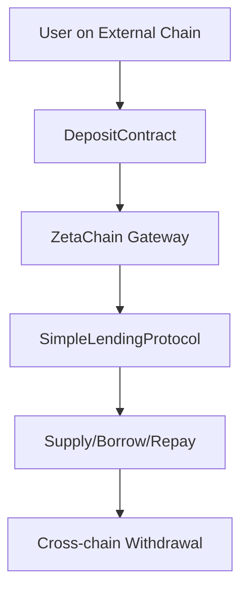
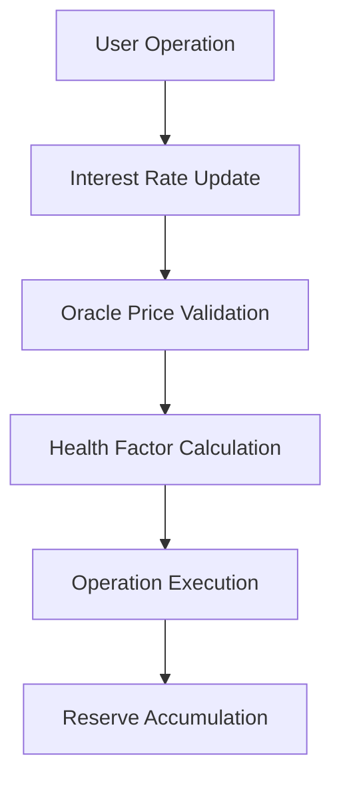

# ZetaChain Cross-Chain Lending Protocol - Technical Implementation

## Overview

This directory contains the complete technical implementation of the ZetaChain Cross-Chain Lending Protocol - a production-ready DeFi lending platform that operates seamlessly across multiple blockchain networks. Built on ZetaChain's Universal EVM, it enables users to perform lending operations across Ethereum, Arbitrum, BSC, Polygon, Base, Solana, and ZetaChain with native cross-chain asset support.

**Key Achievement**: Native cross-chain lending without bridges or wrapped tokens, powered by ZetaChain's ZRC-20 standard and Universal Contract architecture.

## Architecture Overview

### Protocol Variants

1. **SimpleLendingProtocol** (`SimpleLendingProtocol.sol`)
   - Fixed interest rate model
   - Basic health factor calculations
   - Cross-chain operations via ZetaChain gateway
   - Ideal for: Simple lending applications, testing, education

2. **UniversalLendingProtocol** (`UniversalLendingProtocol.sol`)
   - Dynamic kinked interest rate model with RAY precision
   - Advanced weighted health factor calculations
   - Oracle-based pricing with validation
   - Institutional-grade features and gas optimization
   - Ideal for: Production DeFi applications, institutional use

### Core Technology Stack

- **Framework**: Hardhat with TypeScript
- **Language**: Solidity 0.8.26
- **Networks**: ZetaChain Universal EVM, Ethereum, Arbitrum, BSC, Polygon, Base, Solana
- **Standards**: ZRC-20 for cross-chain tokens, ERC-20 compatibility
- **Libraries**: OpenZeppelin (security), custom libraries (calculations)
- **Testing**: Foundry for comprehensive contract testing

### Key Components

- **Gateway Integration**: ZetaChain's EVM gateway for cross-chain operations
- **ZRC-20 Assets**: Native cross-chain token representations
- **Oracle Integration**: Pyth Network price feeds (Universal protocol)
- **Interest Rate Models**: From simple fixed rates to sophisticated kinked models
- **Liquidation Engine**: Automated position management with configurable parameters
- **Cross-Chain Gas Handling**: Automatic fee calculation and payment

## 🚀 Quick Start

### Prerequisites
```bash
# Install dependencies
bun install

# Set up environment variables
cp .env.example .env
# Configure your private keys and RPC URLs
```

### Development Environment Setup
```bash
# Compile contracts
bun run compile

# Run tests
bun run test

# Format code
bun run prettier
```

### Deployment Options

#### Option 1: SimpleLendingProtocol (Recommended for testing)
```bash
# Deploy to ZetaChain testnet
bun hardhat run scripts/simple/deploy-and-init-simple.ts --network zeta-testnet

# Deploy cross-chain deposit contracts
bun hardhat run scripts/deposit-contract/deploy-deposit-contracts.ts --network arbitrum
bun hardhat run scripts/deposit-contract/deploy-deposit-contracts.ts --network ethereum
bun hardhat run scripts/deposit-contract/deploy-deposit-contracts.ts --network bsc
bun hardhat run scripts/deposit-contract/deploy-deposit-contracts.ts --network polygon
bun hardhat run scripts/deposit-contract/deploy-deposit-contracts.ts --network base
bun hardhat run scripts/deposit-contract/deploy-deposit-contracts.ts --network solana

# Test cross-chain deposits
bun hardhat run scripts/deposit-contract/simulate-deposit.ts --network arbitrum
```

#### Option 2: UniversalLendingProtocol (Production-ready)
```bash
# Deploy advanced protocol
bun hardhat run scripts/universal/deploy-universal-lending.ts --network zeta-testnet

# Configure oracle integration
bun hardhat run scripts/universal/check-oracle-prices.ts --network zeta-testnet

# Deploy and test cross-chain infrastructure
bun hardhat run scripts/deposit-contract/deploy-deposit-contracts.ts --network arbitrum
bun hardhat run scripts/deposit-contract/deploy-deposit-contracts.ts --network bsc
bun hardhat run scripts/deposit-contract/deploy-deposit-contracts.ts --network polygon
bun hardhat run scripts/deposit-contract/simulate-deposit.ts --network arbitrum
```

#### Automated Deployment (Shell Scripts)
```bash
# Complete SimpleLendingProtocol deployment
./scripts/redeploy-and-init-simple.sh

# Complete UniversalLendingProtocol deployment
./scripts/redeploy-and-init-universal.sh
```

## 📚 Technical Documentation

### Smart Contract Documentation
- **[contracts/README.md](./contracts/README.md)** - Complete smart contract API reference
- **[contracts/interfaces/](./contracts/interfaces/)** - Interface specifications and documentation
- **[contracts/libraries/](./contracts/libraries/)** - Shared library documentation

### Architecture and Implementation
- **[CROSS-CHAIN-LENDING.md](./CROSS-CHAIN-LENDING.md)** - Cross-chain flows and gateway integration
- **[../UNIVERSAL-LENDING-PROTOCOL.md](../UNIVERSAL-LENDING-PROTOCOL.md)** - Advanced protocol features and design
- **[../README-LENDING.md](../README-LENDING.md)** - Simple protocol implementation details

### Development and Deployment
- **[scripts/README.md](./scripts/README.md)** - Deployment scripts and testing utilities
- **[test/](./test/)** - Foundry test suite and coverage reports
- **[hardhat.config.ts](./hardhat.config.ts)** - Network configuration and settings

### Project Context
- **[../README.md](../README.md)** - High-level project overview
- **[../CLAUDE.md](../CLAUDE.md)** - Development guidelines and context

## 🌐 Network Configuration

### Supported Networks (Currently Deployed)
| Network | Chain ID | Role | Deployed Contracts |
|---------|----------|------|-----------------|
| **ZetaChain Athens** | 7001 | Main protocol deployment | SimpleLendingProtocol, UniversalLendingProtocol |
| **Ethereum Sepolia** | 11155111 | Cross-chain deposits/withdrawals | DepositContract |
| **Arbitrum Sepolia** | 421614 | Cross-chain deposits/withdrawals | DepositContract |
| **BSC Testnet** | 97 | Cross-chain deposits/withdrawals | DepositContract |
| **Polygon Amoy** | 80002 | Cross-chain deposits/withdrawals | DepositContract |
| **Base Sepolia** | 84532 | Cross-chain deposits/withdrawals | DepositContract |

### Deployed Contract Addresses
**ZetaChain Athens (7001):**
- SimpleLendingProtocol: `0xcec503D661A9C56AFa91AcDB4D7A2BFe411a5416`
- UniversalLendingProtocol: `0xb44df318e14d3a162589f76fbc7642a589879e4b`
- MockPriceOracle: `0x3611ec20Ab7904E914E1Dbb47F536fE8c54ddC8E`

**External Chain DepositContracts:**
- Ethereum Sepolia: `0x07058282910F6a7aDC2fe307E92DA56Cd39F183D`
- Arbitrum Sepolia: `0x589521F58dC8FBf99499D7Eb8B31cb1d9d228a0E`
- BSC Testnet: `0x575b07E3cC36eEeC6B94ac5D09f6285ecE2a66dd`
- Polygon Amoy: `0x55E1Bd43F67BaB1E176E2A65608C151bC0d8F148`
- Base Sepolia: `0x701B48270c8d2F2c84746be7CeB003A256E61145`

### ZRC-20 Asset Configuration
**ZetaChain Athens Testnet (Chain ID: 7001) - Deployed Addresses:**
```typescript
// Deployed ZRC-20 addresses for cross-chain assets
ETH_ETH: "0x05BA149A7bd6dC1F937fA9046A9e05C05f3b18b0"     // Ethereum ETH
USDC_ETH: "0xcC683A782f4B30c138787CB5576a86AF66fdc31d"    // Ethereum USDC
ETH_ARBI: "0x1de70f3e971B62A0707dA18100392af14f7fB677"    // Arbitrum ETH
USDC_ARBI: "0x4bC32034caCcc9B7e02536945eDbC286bACbA073"   // Arbitrum USDC
BNB_BSC: "0xd97B1de3619ed2c6BEb3860147E30cA8A7dC9891"     // BSC BNB
USDC_BSC: "0x7c8dDa80bbBE1254a7aACf3219EBe1481c6E01d7"    // BSC USDC
POL_POLYGON: "0x777915D031d1e8144c90D025C594b3b8Bf07a08d"  // Polygon POL
USDC_POLYGON: "0xe573a6e11f8506620F123DBF930222163D46BCB6" // Polygon USDC
ETH_BASE: "0x236b0DE675cC8F46AE186897fCCeFe3370C9eDeD"     // Base ETH
USDC_BASE: "0xd0eFed75622e7AA4555EE44F296dA3744E3ceE19"    // Base USDC
SOL_SOLANA: "0xADF73ebA3Ebaa7254E859549A44c74eF7cff7501"   // Solana SOL
USDC_SOLANA: "0xD10932EB3616a937bd4a2652c87E9FeBbAce53e5"  // Solana USDC
ZETA: "0x0000000000000000000000000000000000000000"       // Native ZETA
```

### Asset Configuration
| Asset | Collateral Factor | Liquidation Threshold | Liquidation Bonus |
|-------|------------------|----------------------|-------------------|
| **ETH** | 80% | 85% | 5% |
| **BNB** | 75% | 80% | 5% |
| **MATIC** | 70% | 75% | 5% |
| **SOL** | 75% | 80% | 5% |
| **USDC** | 90% | 95% | 5% |

## 🏗️ Project Structure

```
lending-zeta/
├── contracts/                          # Smart contract implementation
│   ├── SimpleLendingProtocolBase.sol   # Abstract base contract
│   ├── SimpleLendingProtocol.sol       # Basic lending implementation
│   ├── UniversalLendingProtocol.sol    # Advanced lending with dynamic rates
│   ├── DepositContract.sol             # Cross-chain deposit handling
│   ├── interfaces/                     # Contract interfaces
│   │   ├── ISimpleLendingProtocol.sol  # Core protocol interface
│   │   ├── IUniversalLendingProtocol.sol # Advanced protocol interface
│   │   └── IPriceOracle.sol            # Oracle interface
│   ├── libraries/                      # Optimized calculation libraries
│   │   ├── InterestRateModel.sol       # Kinked rate model with RAY precision
│   │   ├── LiquidationLogic.sol        # Liquidation calculations
│   │   └── UserAssetCalculations.sol   # Gas-optimized asset calculations
│   └── mocks/                          # Testing and development contracts
├── scripts/                            # Deployment and testing automation
│   ├── simple/                         # SimpleLendingProtocol operations
│   ├── universal/                      # UniversalLendingProtocol operations
│   ├── deposit-contract/               # Cross-chain infrastructure
│   └── utils/                          # Shared deployment utilities
├── test/                               # Foundry test suite
│   └── Universal.t.sol                 # Comprehensive protocol tests
├── contracts.json                      # Deployed contract addresses registry
├── hardhat.config.ts                   # Network and compilation configuration
└── package.json                        # Dependencies and scripts
```

## Core Contract Interactions

### SimpleLendingProtocol Flow


### UniversalLendingProtocol Flow


## Development Guidelines

### Code Standards
- **Solidity Version**: 0.8.26 (strict compilation)
- **Package Manager**: Bun (specified in CLAUDE.md)
- **Linting**: ESLint with no disable comments allowed
- **Testing**: Comprehensive Foundry test coverage
- **Documentation**: Extensive NatSpec for all public functions

### Security Best Practices
- **Reentrancy Protection**: All state-changing functions use `nonReentrant`
- **Access Control**: Owner-only admin functions, gateway-only cross-chain calls
- **Input Validation**: Comprehensive parameter validation and bounds checking
- **Oracle Security**: Price staleness and manipulation protection
- **Health Factor Enforcement**: Multiple validation layers for borrowing safety

### Performance Optimization
- **Gas Efficiency**: Consolidated calculations using custom libraries
- **Memory Management**: Efficient struct usage and storage patterns
- **Loop Optimization**: Single-pass calculations for user data
- **Event Emission**: Comprehensive logging for off-chain monitoring

## 🔗 External Resources

### ZetaChain Development
- **[ZetaChain Docs](https://www.zetachain.com/docs/)** - Official developer documentation
- **[Universal Contract Tutorial](https://www.zetachain.com/docs/developers/tutorials/hello/)** - Getting started with ZetaChain
- **[Gateway Integration](https://www.zetachain.com/docs/developers/tutorials/swap/)** - Cross-chain operation implementation
- **[ZRC-20 Standard](https://www.zetachain.com/docs/developers/tokens/zrc20/)** - Cross-chain token specification

### DeFi References
- **[Aave Protocol](https://docs.aave.com/)** - Reference lending protocol design
- **[Compound Finance](https://compound.finance/docs)** - Interest rate model inspiration
- **[OpenZeppelin](https://docs.openzeppelin.com/)** - Security contract libraries

---

**Ready to build?** Start with the [Quick Start](#-quick-start) section or dive into the [smart contract documentation](./contracts/README.md).